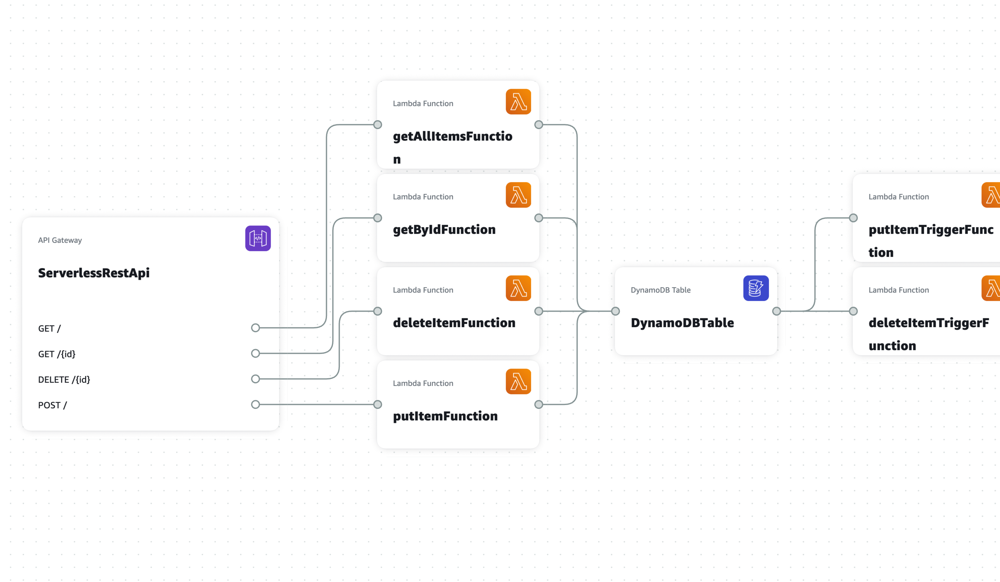

# event-filtering-with-dynamo-streams

The SAM application is available in [/event-filtering](./event-filtering)

The feature is explained on the blogs -
- [AWS announcement blog](https://aws.amazon.com/about-aws/whats-new/2021/11/aws-lambda-event-filtering-amazon-sqs-dynamodb-kinesis-sources/)
- [Trigger Lambda Functions with event filtering](https://dev.to/aws-builders/trigger-lambda-functions-with-event-filtering-2pnb)
- [Deep dive into Lambda event-filters for DyanmoDB](https://dev.to/aws-builders/deep-dive-into-lambda-event-filters-for-dyanmodb-320)

This is a demo application built for AWS Community Day ASEAN 2021

[Avengers level threat](https://avengerthreat.zachjonesnoel.com)